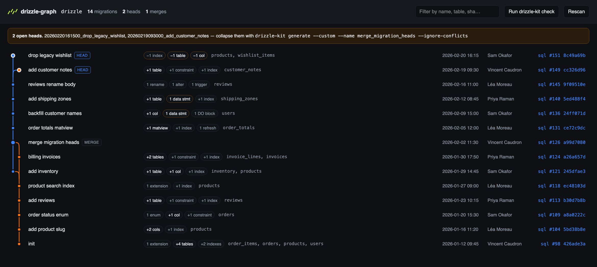
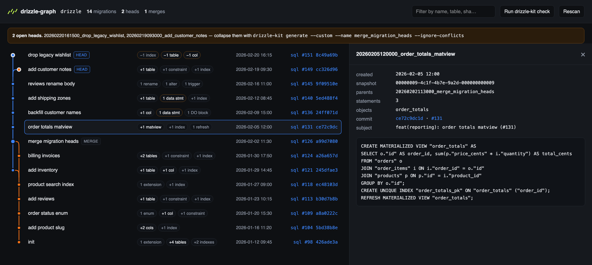

<div align="center">


# drizzle-graph

**Browse and guard a Drizzle migration graph.**

A git-log-style view of the Drizzle Kit v1 migration DAG, and a CI guard that fails
a pull request before it can leave your target branch forked.

[](https://www.npmjs.com/package/drizzle-graph)
[](https://github.com/Vincweb/drizzle-graph/actions/workflows/ci.yml)
[](package.json)
[](package.json)
[](LICENSE)

</div>

<br>

<div align="center">

</div>

<br>

```sh
npx drizzle-graph            # browse it
npx drizzle-graph --check    # fail CI when the graph has more than one head
```

## Why

Drizzle Kit v1 stores migration history as a DAG: each `snapshot.json` pins its parents in
`prevIds`, so two branches can add migrations independently and `drizzle-kit check` only complains
when they don't commute. Nothing in the toolchain prints that graph, which makes two situations
invisible until they hurt:

- **The graph is forked.** `drizzle-kit check` is green on several open heads as long as they
  commute, so a branch can merge, leave the target forked, and say nothing. The next branch then
  absorbs the same fork independently, and _that_ is when `check` fails — reporting conflicts on
  objects neither branch ever touched.
- **A parent doesn't exist.** A `prevIds` entry no folder declares survives every check.

## Install

No install needed to try it:

```sh
npx drizzle-graph
```

As a dev dependency:

```sh
npm i -D drizzle-graph
pnpm add -D drizzle-graph
```

Requires Node 20+. Works with any Drizzle Kit v1 migrations folder (one directory per migration,
each holding `migration.sql` and `snapshot.json`).

## Browse

```sh
drizzle-graph                             # serves ./drizzle, or offers what it finds
drizzle-graph --dir packages/db/drizzle   # anywhere else
drizzle-graph --port 5000
```

Open the printed URL. **`/` is a folder picker** holding what it found under the working directory:
the folders a `drizzle.config.*` declares as its `out`, and the ones that simply look like a
migrations folder — each with how many migrations it holds and where it came from. Pick one and its
graph opens at **`/graph?dir=packages/db/drizzle`**; the path in the header takes you back to the
picker, without restarting anything.

The folder is in the URL, not in the server, so a graph can be reloaded, bookmarked, opened in a
second tab beside another folder, or sent to someone with the same checkout — and ⌘-click on a
candidate opens it in a tab of its own. Starting with `--dir` prints that link directly.

There is also a path field, and it **completes as you type**, one directory at a time, the way a
shell does: what you typed before the last slash is listed, what follows filters it, `Tab` takes
the only match, and a folder holding migrations offers to open straight away. Clicking the field —
or the **Browse** button beside it — opens the same list without typing anything. A browser never hands
absolute paths to a page, so the listing comes from the server — directory names only.

A Drizzle config is **read as text** to find its `out` — never imported, never executed, so nothing
in your `.env` is read and no database is contacted. `node_modules` is never searched.

The page gives you, per migration:

- **git-log-style lanes** rebuilt from `prevIds` — merges drawn as merges, open heads flagged,
  a `prevIds` entry with no folder drawn as a greyed-out phantom node rather than a dropped edge
- **a summary of the SQL** — `+2 tables`, `+12 cols`, `−1 index`, `2 matviews`, `1 data stmt`,
  `1 DO block` — from a statement splitter that respects `$$` blocks, quotes and comments
- **the objects touched**, the migration timestamp, and the commit, author and PR that added the
  folder (from a single `git log`)
- **the full `migration.sql`** in a side panel, fetched on click

<div align="center">

</div>

The folder is rescanned on every request, so generating a migration and hitting Rescan is enough —
no restart, no build step, no generated file to clean up.

**It works on a narrow window too.** A row is one lane tall, so it cannot wrap: it drops columns
instead — the objects and the author go first, then the links and the badges, leaving the name and
the date. A migration you open takes the whole screen rather than half of it, and the filter moves
behind a magnifier that opens a field of its own — closing it clears the filter, so no row stays
dimmed by a field you can no longer see.

### The check panel

The **Run drizzle-kit check** button runs the real `drizzle-kit check --output json` and reads its
report, then tells you which kind of conflict you have:

- **the same statement on both branches** — two branches merged the same fork independently, so
  nothing actually has to run: an empty merge migration collapses the graph
  (`drizzle-kit generate --custom --name merge_migration_heads --ignore-conflicts`)
- **different statements on the same object** — the branches genuinely disagree, and the merge
  needs real SQL

That distinction is the whole reason this panel exists: `check` gives you the same wall of text
either way.

## Guard

```sh
drizzle-graph --check
```

Prints the open heads and exits 1 when there is more than one, so a pull request cannot leave the
target branch forked. It warns (without failing) about `prevIds` entries no folder declares, which
are usually pre-existing.

```yaml
- run: npx drizzle-graph --check --dir packages/db/drizzle
```

It reads only the filesystem and `git` — no database connection, and no `.env`: even a
`drizzle.config.ts` is only ever read as text.

## Options

| Option             | Default     | What it does                                             |
| ------------------ | ----------- | -------------------------------------------------------- |
| `-d, --dir <path>` | `./drizzle` | migrations folder                                        |
| `-p, --port <n>`   | `4600`      | port to serve on                                         |
| `--host <host>`    | `127.0.0.1` | host to bind                                             |
| `-c, --check`      |             | print the open heads, exit 1 when there is more than one |
| `-h, --help`       |             | show the usage                                           |
| `-v, --version`    |             | show the version                                         |

## API

The same scan is available programmatically:

```ts
import { createScanner, checkMigrationHeads, serveMigrationGraph } from 'drizzle-graph'

const { buildGraph, readMigrationSql, runDrizzleCheck } = createScanner({
  migrationsDir: 'packages/db/drizzle',
})

const { rows, heads, unresolved, laneCount } = buildGraph()
```

`buildGraph()` returns one row per migration — `folder`, `id`, `parents`, `parentFolders`,
`createdAt`, `badges`, `tables`, `statementCount`, `commit`, plus the lane geometry (`lane`,
`incoming`, `outgoing`, `passThrough`, `isMerge`, `isHead`) — and the repository URL and path so
links can be built. It does **not** include the SQL; `readMigrationSql(folder)` reads one on
demand and returns `null` for anything outside the migrations folder.

## HTTP routes

Served for the page, and usable directly:

| Route                             | What it returns                                              |
| --------------------------------- | ------------------------------------------------------------ |
| `GET /api/graph?dir=`             | the whole graph, without the SQL                             |
| `GET /api/migration?dir=&folder=` | one `migration.sql`                                          |
| `GET /api/check?dir=`             | `drizzle-kit check --output json`, on demand                 |
| `GET /api/dirs`                   | the folder `--dir` named, and the candidates found around it |
| `GET /api/browse?path=`           | one directory listing, for the path field                    |

`dir` is resolved against the working directory the server was started in, and falls back to the
one `--dir` named. Every read names its own folder, so the server holds no "current" one.

## Notes

**No runtime dependency.** The server is `node:http`, and React, TanStack Query and Tailwind are
bundled into the page at build time — so installing this pulls in nothing else, and the page
fetches nothing from a CDN. `drizzle-kit` is only invoked when you ask for a check, resolved from
the nearest `node_modules/.bin` and falling back to `npx`.

`?dir=` takes a path from a URL, so it only accepts a directory that exists and holds at least one
`snapshot.json`; `GET /api/browse` answers directory **names** and never their contents. A check
starts the `drizzle-kit` nearest the folder it names, so it is refused unless `Sec-Fetch-Site` says
it came from the page itself — another page in the same browser cannot read these answers, and
cannot pick what runs either. The server binds to `127.0.0.1` unless you pass `--host`, and no response carries an
`Access-Control-Allow-Origin` header — which is what stops another page in the same browser from
reading either of them, and the reason none should ever gain one.

The page carries a favicon and a web manifest, so it keeps its name and icon in a tab and can be
installed as an app. There is no service worker: this is a local devtool, and it has nothing to
say when the server it reads from is not running.

Drizzle Kit v0 (a single `meta/_journal.json`) has no DAG to draw and is not supported.

## Development

```sh
pnpm install
pnpm dev --dir test/fixtures/two-heads
```

`pnpm dev` starts both halves: the API server on `127.0.0.1:4600` — the CLI, from source, with
whatever arguments you passed, restarted whenever a server file changes — and the Vite dev server
on `localhost:4601`, which serves the page and proxies `/api` to it. **Open the Vite URL**,
`http://localhost:4601`: that is the one that hot-reloads. Opening `4600` in dev hands you a link
to the same route there, rather than the last build.

| Command           | What it does                                                       |
| ----------------- | ------------------------------------------------------------------ |
| `pnpm dev`        | API server and Vite dev server, side by side                       |
| `pnpm dev:api`    | the API server alone, from source                                  |
| `pnpm dev:web`    | the Vite dev server alone                                          |
| `pnpm test`       | `node:test` over the fixtures in `test/fixtures/`                  |
| `pnpm lint`       | ESLint over the repository                                         |
| `pnpm type-check` | `tsc` over the repository                                          |
| `pnpm format`     | Prettier, in place                                                 |
| `pnpm build`      | `tsup` → `dist/` (CLI and API), `vite` → `dist/client/` (the page) |
| `pnpm check`      | lint, types, tests and build, in one go                            |

Built with **React 19**, **TypeScript**, **Vite**, **Tailwind CSS v4** and **TanStack Query**, all
bundled at build time. Contributors want the Node in [.nvmrc](.nvmrc) — Vite asks for 20.19+ or
22.12+, while the published package itself still runs on Node 20.

### Layout

```
src/cli.ts        the flags, then either --check or the server
src/index.ts      the public API
src/shared/       the shapes the server sends and the client reads
src/server/       scan.ts     the DAG, the SQL summary, the git history
                  discover.ts the migrations folders found around the working directory
                  check.ts    the CI guard
                  server.ts   the /api routes, each reading the folder its request names
                  static.ts   the built client, served from dist/client
src/client/       the page: App.tsx, router.ts (/ and /graph), queries.ts, components/
                  public/     favicon, icons and the web manifest
```

Four fixtures cover the shapes that matter: `single-head`, `two-heads`, `unresolved-parent` and
`discover` (a config declaring an `out`, a folder that merely looks like one, and a `node_modules`
decoy).
CI runs the same on Node 22, plus `format:check`, then smoke-tests the built CLI against them;
releases are published to npm from a `v*` tag, with provenance.

Issues and pull requests are welcome. Changes worth mentioning go in [CHANGELOG.md](CHANGELOG.md).

## License

MIT © [Vincent Caudron](https://github.com/Vincweb)

A community project, not affiliated with or endorsed by the Drizzle Team. The Drizzle mark in the
banner comes from [drizzle-team/drizzle-orm](https://github.com/drizzle-team/drizzle-orm) and
belongs to them.
